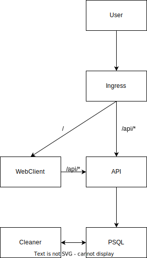

# File Drop
This is a fairly stright forward FOSS file share service. The goal is simple drop a file, upload it and share the link to family, friends and so on.


## TL;DR
### Docker Compose
Deploy the App by using the `docker-compose.yaml` to get the app running in a minute or two.
The service will be reachable on port `8080` of your machine.

### Kubernetes
See the [README.md](./charts/file-drop/) of the Chart on how to deploy things.
You'll need an already running database reachable from your cluster. You can use the Zalando Postgres Operator to manage your pg clusters for example.


## The Goal

This Project was created beacause there were a lot of projects that didn't satisfy my needs of
> "I need a file-host that i can deploy myself, that isn't a pain in the ass to deploy as Container and auto deletes files after a given period"

*Yes I am aware of [XKCD 927](https://xkcd.com/927/)*

Hence this project was born.

## Features

**A Web GUI to upload the files which includes**
* encryption (soon)
* selectable expiry date (soon)
* a QR code to the download link

**An API handling**
* uploads
* downloads
* burn files after N downloads (soon when the frontend is done)

**The Cleaner**
* Checks for expired files and deletes them
* Checks for "burned" files

## Configuration and Deployment
This project was made to run inside containers and as scalable microservice architecture.

**I would not reccommend running it as plain binaries**

If you want to use the `docker-compose.yml` you will need a reverse proxy routing the API endpoints to the respective services. You can use the [./src/nginx.conf](./src/nginx.conf) for an example routing.

Otherwise use the `docker-compose-nginx.yml` file for a simple setup.

## CLI Flags / ENV Vars

The following utput can be retrieved with e.g. `go run cmd/server/main.go --help`.

The format is short-flag, long-flag and it's default value, description and the ENVIRONMENT_VAR you can use to configure it.

```
Flags:
  -l, --listen="0.0.0.0:8080"  HTTP Listen Address ($FD_HTTP_ADDRESS)
  -H, --db-host="postgres"     Database Host ($FD_DB_HOST)
  -p, --db-port="5432"         Database Host ($FD_DB_PORT)
  -U, --db-user="postgres"     Database User ($FD_DB_USER)
  -P, --db-password="s3cr3t!"  Database Password ($FD_DB_PASSWORD)
  -N, --db-name="postgresdb"   Database Name ($FD_DB_NAME)
  -S, --db-ssl-mode=disable    Database SSL Mode ($FD_DB_SSL_MODE)
  -R, --db-connect-retry=5     Database connection retry count ($FD_DB_RETRY)
```

## The Architecture



The Project consists of

* A Web Client which is a Container that deploys the Frontend in the Browser
* The API which handles uploads and downloads of the files
* A cleaner which runs every few minutes to remove files which expired or are marked as burned

___
This Project is subject to the GNU/AGPL License

(c) Ryuko
