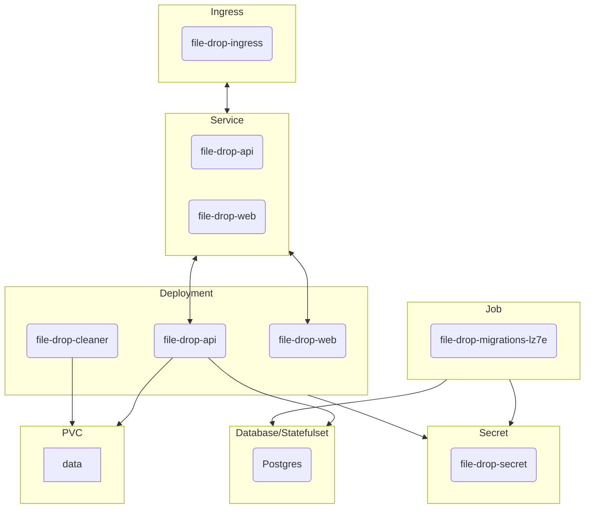

# File Drop Helm

This Chart deploys the filedrop service.

All values and their usage is described in the `values.yaml` of the chart.

Running without an ingress is not supported at the moment but still possible. Feel free to do so.

## Deployment

### Requirements
#### Database
You'll need to have a running Postgres Database reachable from your Cluster.

If not already existent, create a Secret containing the Username and Password for the Database. And set the keys in `extraEnvSecret.database.usernameKey` and `extraEnvSecret.database.passwordKey`. Also set the hostname of the DB in `extraEnvSecret.database.hostname`.

Alternatively create a Secret Containing all your environment variables needed to launch the application and reference it in the `extraEnvSecret.name` field and set `extraEnvSecret.create = false`.

#### Storage
Your Storage <text style="color:red">**must**</text> support multiattach (**ReadWriteMany**) Volumes so . Since the api and cleaner both need to access the files.

### Install

Clone the repo and run  the helm install command from within the chart's directory

```sh
helm upgrade --create-namespace --install filedrop -n filedrop-1 -f values.yaml .
```

## Architecture

